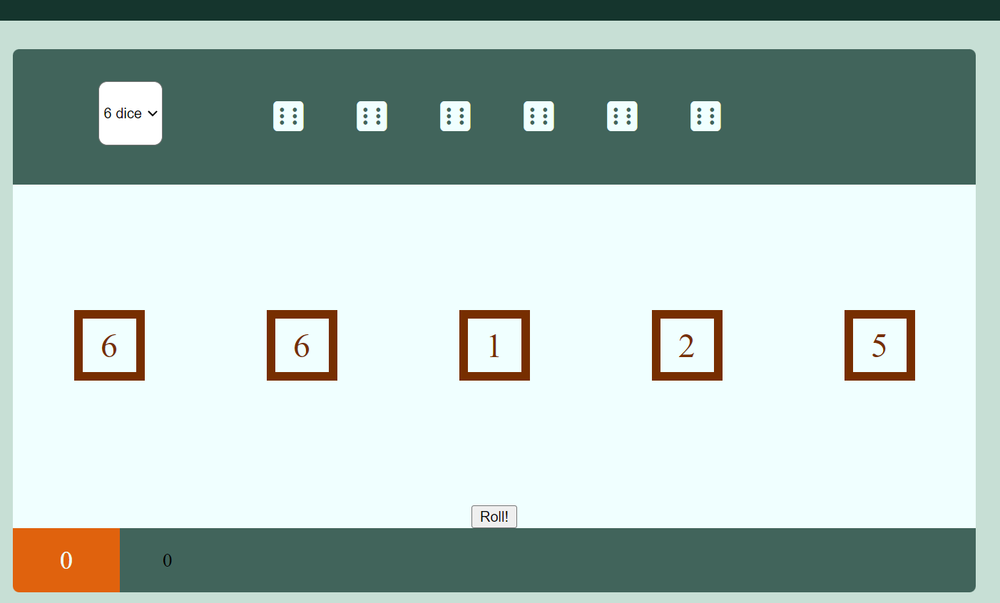
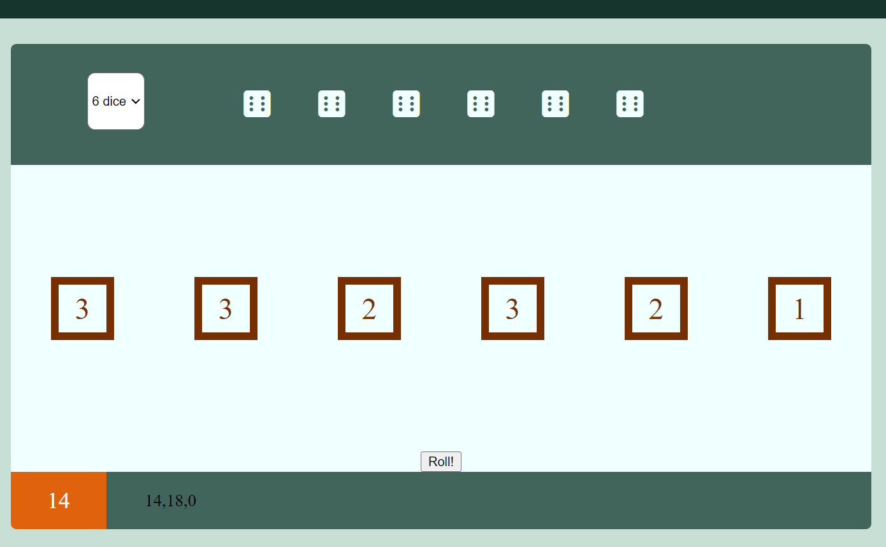

# Di[c]e Simulator #

## Troubleshooting and Debugging ##
- **displaySum() function bug:**  
    Whenever the dice where rolled via the "click" event listener for the "Roll!" button, the amount of dice displayed in the simulator area would not correspond to the amount of dice selected in the "settings" area. In fact, for any amount of dice greater than 1, there would be exactly 1 fewer dice visible in the simulator area. (see screenshot below:)  
    
    The amount of dice rolled in the above screenshot should be 6. Though the simulation area only displays 5.  
    
    Initial troubleshooting using the dev tools console found that in the a "*for loop array*" in the JavaScript function responsible for displaying the diceit was always the object with an index of [1] that was missing.  
    After running through the code and using the process of elimination, it was deduced that the error was seemingly occuring in the displaySum() function.
    
    **Fix:**  
    Loging different values in different functions would occasionally return "*NaN*" values, but the cause for this was never identified. A simpler solution was implemented which also had the benefit of processing less code. The location from which the function was called had previously been in the "*rollDice() function*". This meant that the function would compute the sum after every die roll and display it. So when the "*rollDice() function*" would be iterated, ultimately only the sum from last iteration is visible to the viewer. Therefore the solution was to move the function call from the *"rollDice()"* and add it to the event listener function to be called after the last "*rollDice()*" iteration instead. (See screenshot below:)  
    

    

## Sources ##
Troubleshooting and tutorials:  
https://www.dyn-web.com/tutorials/  
https://www.sitepoint.com/community/ 
https://www.geeksforgeeks.org/  
https://www.javascripttutorial.net/  
https://www.educative.io/edpresso/  