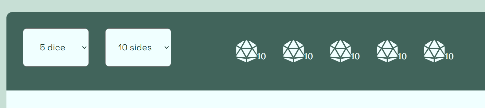
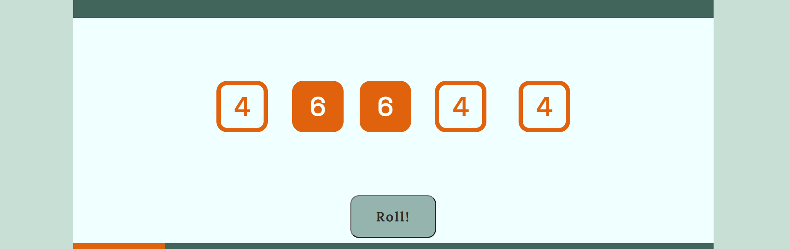
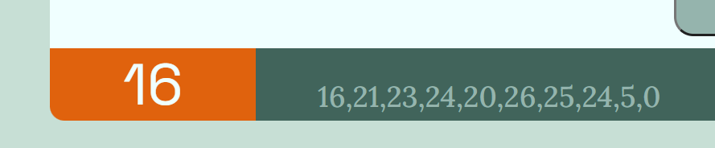

# Di[c]e Simulator

## [>>Link to the live project<<](https://fabianlien.github.io/Di-c-e-Simulator/) ##

The title of this website is pretty self-explanatory (which is an important point!). It simulates a single die (or up to 6 dice) in a virtual environment by generating random numbers at the push of a button, akin to rolling dice. The simulator aims to be a convenient and easy-to-use replacement of physical dice. It has intuitive design and functionality that allows it to be conveniently used for popular dice games such as  Yatzee.

All in all, this is your trusty one-size-fits-all digital dice companion. Ideal for when you are lacking horisontal surface area, when you have misplaced your physical dice, or simply for the sake of time efficiency!

## Existing Features

* ### **Title banner**
  The top of the page boldly displays the logo/title of the website in large partially colored text, with the sole purpose of giving the user a clear indication of what website they are on. The somewhat obvious title banner together with the color scheme strive to make the website memorable in order to stand out from other simulators, without being obtrusive.
  

* ### **Settings Area**
  * This visual area beneath the title banner allows the user to interact with two HTML "<select></select>" elements in order to determine the amount of dice and sides the user wishes to simulate. By not allowing text input, the risk for user input error is eliminated. It also makes the simulator usable without a text-input device (keyboard). The amount of dice selected with the corresponding amount of selected sides are shown to the right of the "<select></select>" elements (as seen below):
  

  * on the right side there are two clickable "icons" with internationally recognizable symbols. the "?", when hovered over, shows text-based instructions on how the simulator is used. Though it is also easily utilized through intuition. The second "icon" contains a speaker symbol, which when clicked on, mutes/unmutes an audio file of dice rolling which is triggered when the di(c)e are rolled.
  

* ### **Sumaltion Area**
  This featuere takes up the large real-estate area of all features. It displays the current amount of dice and their individual scores. When the user clicks/taps "<button>Roll!</button>" a psuedo animation is fired which causes the dice to generate random numbers over short intervals for the span of a second before displaying the final score. This feature also lets the user interact with the simulated dice by "marking" dice to "hold" them when the "<button>Roll!</button>" button is clicked. An example of this can be seen below where the two orange-filled dice displaying a score of "6" are being "held".
  

* ### **Score Area**
  This feature shows the current sum of all the dice scores in the simulation area in large visible text. This prevents the user from having to count the dice manually as is the case with physical dice. This feature also contains a a list of previous scores in case the user needs to back-track to check an old score. These scores are displayed in a less obtrusive colour, so as to not distract from the curent score or clutter the window.
  

* ### **Footer**
  The website has a small footer containing two "<button>Buttons</button>". When clicked these provide clarity via pop-up windows containing text about the purpose of the website and a link to the CC license .wav file (used for the roll sound), respectively. Similarly to the list of previous scores mentioned in the previous feature, the color and text are quite small in order to not clutter the window with unnecessary text.
  

## Troubleshooting and Debugging ##
- **displaySum() function bug:**  
    Whenever the dice where rolled via the "click" event listener for the "Roll!" button, the amount of dice displayed in the simulator area would not correspond to the amount of dice selected in the "settings" area. In fact, for any amount of dice greater than 1, there would be exactly 1 fewer dice visible in the simulator area. (see screenshot below:)  
    
    The amount of dice rolled in the above screenshot should be 6. Though the simulation area only displays 5.  
    
    Initial troubleshooting using the dev tools console found that in the a "*for loop array*" in the JavaScript function responsible for displaying the diceit was always the object with an index of [1] that was missing.  
    After running through the code and using the process of elimination, it was deduced that the error was seemingly occuring in the displaySum() function.
    
    **Fix:**  
    Loging different values in different functions would occasionally return "*NaN*" values, but the cause for this was never identified. A simpler solution was implemented which also had the benefit of processing less code. The location from which the function was called had previously been in the "*rollDice() function*". This meant that the function would compute the sum after every die roll and display it. So when the "*rollDice() function*" would be iterated, ultimately only the sum from last iteration is visible to the viewer. Therefore the solution was to move the function call from the *"rollDice()"* and add it to the event listener function to be called after the last "*rollDice()*" iteration instead. (See screenshot below:)  
    

## Testing
### Validators:
**HTML:**  
No errors were returned when passing through the official W3C validator.  
**CSS:**  
No errors were returned when passing through the official (Jigsaw) validator.
**JavaScript:**
No errors were identified by JSHint.

## Deployment
Initial deployment occured via [GitHub Pages](https://pages.github.com/).  
An active link to the deployed website can be found at the top of this document. Otherwise, click [here](https://fabianlien.github.io/Di-c-e-Simulator/).

### Deployment via GitHub Pages
The project was deployed to GitHub Pages using the following steps...
1. Log in to GitHub and locate the GitHub Repository
2. At the top of the Repository (not top of page), locate the "Settings" Button on the menu.
3. Select "Pages" from the menu on the left hand side..
4. Under "Source", click the dropdown called "None" and select "Master Branch".
The page will automatically refresh.
5. The published link will appear shortly in a green box at the top of the page.

### Forking the GitHub Repository
By forking the GitHub Repository we make a copy of the original repository on our GitHub account to view and/or make changes without affecting the original repository by using the following steps...

1. Log in to GitHub and locate the GitHub Repository
2. At the top of the Repository (not top of page) just above the "Settings" Button on the menu, locate the "Fork" Button.
3. You should now have a copy of the original repository in your GitHub account.

### Making a Local Clone
1. Log in to GitHub and locate the GitHub Repository
2. Under the repository name, click "Clone or download".
3. To clone the repository using HTTPS, under "Clone with HTTPS", copy the link.
4. Open Git Bash
5. Change the current working directory to the location where you want the cloned directory to be made.
6. Type "*git clone*", and then paste the URL you copied in Step 3.
`$ git clone https://fabianlien.github.io/Di-c-e-Simulator/`

7. Press Enter. Your local clone will be created.  
`$ git clone https://fabianlien.github.io/Di-c-e-Simulator/`  
`> Cloning into CI-Clone>...`  
`> remote: Counting objects: 10, done.`  
`> remote: Compressing objects: 100% (8/8), done.`  
`> remove: Total 10 (delta 1), reused 10 (delta 1)`  
`> Unpacking objects: 100% (10/10), done.`

## Credits ##
Troubleshooting and tutorials:  
https://www.dyn-web.com/tutorials/  
https://www.sitepoint.com/community/ 
https://www.geeksforgeeks.org/  
https://www.javascripttutorial.net/  
https://www.educative.io/edpresso/  
https://developer.mozilla.org/  

## Media ##
Dice rolling sound: https://freesound.org/s/220744/  
